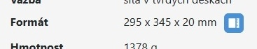
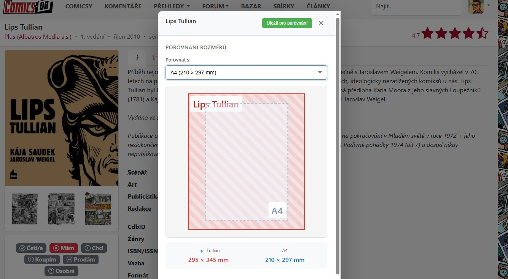

# BookScale

**Visualize book dimensions before you buy**

---

## What is BookScale?

BookScale is a browser extension that helps you understand the actual size of books, comics, and manga before purchasing. Simply visit a supported online bookstore, and a ruler icon will appear next to the book dimensions. Click it to see a visual comparison with standard formats.

## Features

- **Visual Size Comparison** — Compare books with standard formats: A4, A5, US Comic, Omnibus, Tankobon, BD Album, and more
- **Spine Thickness** — See how thick the book is compared to everyday objects (matchbox, deck of cards, coin)
- **Save Books** — Save books for later comparison across different stores
- **Automatic Detection** — Works automatically on supported websites
- **Multilingual** — Available in English and Czech

## Installation

### From Browser Stores (Recommended)

| Browser | Status | Link |
|---------|--------|------|
| **Google Chrome** | Available | [Chrome Web Store](https://chromewebstore.google.com/detail/bookscale/bkjkdinpddelgkamlagodbfdmnimaddp) |
| **Mozilla Firefox** | Available | [Firefox Add-ons](https://addons.mozilla.org/cs/firefox/addon/bookscale/) |
| **Microsoft Edge** | Available | [Edge Add-ons](https://microsoftedge.microsoft.com/addons/detail/knihometr/bbepimjanicaknkoieiljegaaiccjfol) |

### Manual Installation (for developers)

Chrome / Edge

1. Download or clone this repository
2. Open `chrome://extensions/` (or `edge://extensions/`)
3. Enable **Developer mode**
4. Click **Load unpacked**
5. Select the project folder containing `manifest.json`

Firefox

1. Download or clone this repository
2. Open `about:debugging#/runtime/this-firefox`
3. Click **Load Temporary Add-on...**
4. Select `manifest.firefox.json`

Note: Temporary add-ons are removed when Firefox closes.

## Supported Websites

BookScale currently works on these online bookstores:

| Store | Website |
|-------|---------|
| ComicsDB | [comicsdb.cz](https://comicsdb.cz) |
| Crew | [obchod.crew.cz](https://obchod.crew.cz) |
| ComicsPoint | [comicspoint.cz](https://comicspoint.cz) |
| ComicsCentrum | [comicscentrum.cz](https://comicscentrum.cz) |
| Knihy Dobrovský | [knihydobrovsky.cz](https://knihydobrovsky.cz) |
| Arkham | [arkham.cz](https://arkham.cz) |
| Krakatit | [krakatit.cz](https://krakatit.cz) |
| Albatros Media | [albatrosmedia.cz](https://albatrosmedia.cz) |
| XYZ | [xyz.cz](https://xyz.cz) |
| Kosmas | [kosmas.cz](https://kosmas.cz) |
| Martinus | [martinus.cz](https://martinus.cz) |
| Megaknihy | [megaknihy.cz](https://megaknihy.cz) |

## How to Use

1. Visit a book detail page on any supported website
2. Look for the **ruler icon** next to the book dimensions
3. Click the icon to open the comparison dialog
4. Select a reference format from the dropdown to compare sizes
5. Optionally save the book for later comparison

## License

MIT

---

Made with visual precision for book lovers

